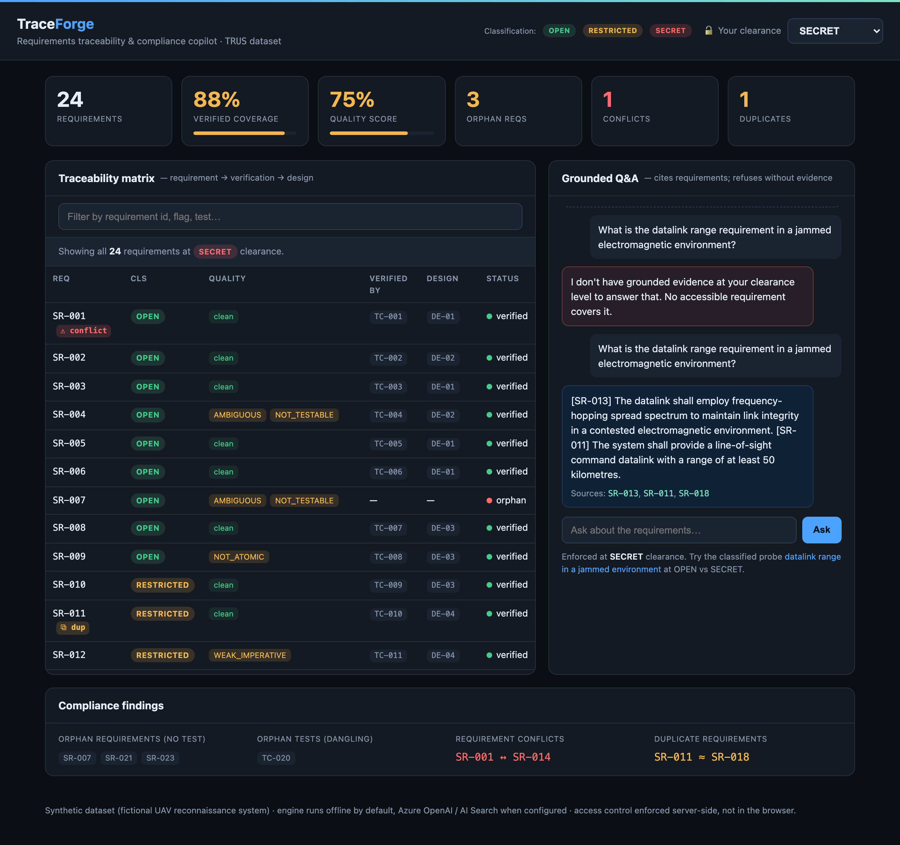
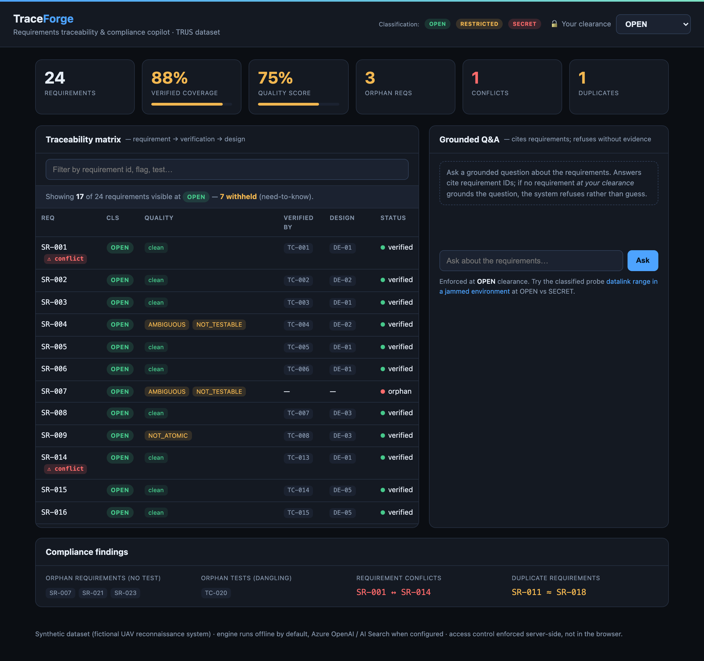

# TraceForge

[](https://github.com/Tonyk91/traceforge/actions/workflows/ci.yml)

**A requirements traceability & compliance copilot for safety- and security-critical systems.**

Certification standards for defense, aerospace and rail systems — DO-178C, MIL-STD-498,
ARP4754A, EN 50128 — all mandate **bidirectional requirements traceability**: every "shall"
requirement must trace down to design, implementation and verification, and every test must
trace back up to a requirement. In practice, requirement specifications run to thousands of
natural-language statements riddled with ambiguity, conflicts and duplicates. Systems engineers
spend weeks maintaining traceability matrices by hand, and *orphan requirements* (no verifying
test) and *orphan tests* (no parent requirement) are hard certification blockers found late.

TraceForge ingests raw requirement documents and produces a queryable, auditable compliance
picture:

- **Structures** every requirement out of prose (LLM extraction, deterministic fallback).
- **Grades quality** against EARS / INCOSE rules — ambiguity, testability, atomicity, missing
  verification method.
- **Links traceability** semantically across requirements ↔ tests ↔ design, and flags
  **orphans, conflicts and duplicates**.
- **Answers questions** with grounded, cited answers behind an evidence gate that refuses when
  support is weak (no hallucinated compliance claims).
- Enforces **classification-aware access control** — retrieval respects the caller's clearance,
  so a query never surfaces content above its need-to-know.
- Exposes everything over an **MCP server** so it drops into existing agent tooling.

> ⚠️ All data in this repository is **synthetic and unclassified** — a fictional "Tactical
> Reconnaissance UAV System (TRUS)" authored specifically to seed known defects for evaluation.

---

## Dashboard

The same clearance travels through the whole product. Below, the identical question is asked at
**SECRET** (answered, with citations) after being **refused at OPEN** — and the traceability
matrix shows all 24 requirements, including the RESTRICTED/SECRET rows withheld from lower
clearances. Access control is enforced server-side, not hidden in the browser.



<details>
<summary>Same dashboard at OPEN clearance — 7 requirements withheld, the classified probe refused</summary>



</details>

---

## Architecture

TraceForge is built as a **medallion lakehouse** so ingestion, structuring and serving are
cleanly separated and independently testable.

```
 ┌── Bronze ──────────┐   ┌── Silver ─────────────────┐   ┌── Gold ────────────────────┐
 │ Raw docs           │   │ Structured requirements   │   │ Retrieval index (hybrid)   │
 │  SRS.md / .pdf     │──▶│  + quality flags          │──▶│ Traceability graph         │
 │  tests.csv         │   │  + classification marking │   │  (req ↔ test ↔ design)     │
 │  design.csv        │   │  atomic "shall" rows      │   │ Coverage / compliance rollup│
 └────────────────────┘   └───────────────────────────┘   └────────────────────────────┘
   Azure Blob / local        DuckDB (Delta/Databricks           Azure AI Search / local
                              -shaped SQL + PySpark)             vector+BM25 (RRF+rerank)

           orchestrated as an Airflow-style DAG:  ingest → parse → quality → classify → index → link
```

**Layers map to a real cloud stack, with an offline fallback for every hop:**

| Concern            | Azure (production)                 | Local (offline / CI)              |
|--------------------|------------------------------------|-----------------------------------|
| Raw store (bronze) | Azure Blob / S3                    | `./data/bronze`                   |
| Compute / SQL      | Databricks + Delta (medallion)     | DuckDB + Parquet                  |
| LLM + embeddings   | Azure OpenAI                       | deterministic rule/hash engine    |
| Retrieval (gold)   | Azure AI Search                    | in-process numpy vectors + BM25   |
| Serving            | FastAPI on Azure Container Apps    | `uvicorn` locally                 |
| Integration        | MCP server                         | MCP server (stdio)                |

The offline path means the **entire pipeline and eval suite run with zero external calls** — set
Azure credentials in `.env` to flip each hop to the cloud implementation. See
[`docs/architecture.md`](docs/architecture.md).

---

## Quickstart

```bash
python -m venv .venv && source .venv/bin/activate
pip install -e ".[dev]"        # add ",azure,mcp" for cloud + MCP

# Run the medallion pipeline over the synthetic TRUS dataset
traceforge pipeline run

# Compliance report: coverage %, orphans, conflicts, duplicates, quality score
traceforge report

# Ask a grounded question (respects your clearance)
traceforge ask "Which requirements have no verifying test?" --clearance RESTRICTED

# Serve the engine as MCP tools for agents (Claude Desktop, IDE copilots) — see docs/mcp.md
python -m traceforge.mcp_server         # stdio server
python -m traceforge.mcp_client_demo    # smoke test: lists tools, proves clearance enforcement

# Compliance dashboard + grounded chat (served by the API itself)
uvicorn traceforge.api:app --reload     # dashboard at http://localhost:8000/  · Swagger at /docs
```

The dashboard shows coverage/quality KPIs, the traceability matrix, and grounded Q&A. Switching
the **clearance** selector re-queries the server: requirements above your clearance are withheld
from the matrix and the chat refuses to answer from content you cannot see — need-to-know is
enforced server-side, not hidden in the browser.

---

## Design principles

- **Grounded or silent.** Every answer cites its source requirements/tests; the evidence gate
  refuses rather than guess. Compliance tooling must not hallucinate.
- **Need-to-know by construction.** Classification is a first-class attribute carried from bronze
  to gold; access control is enforced *inside* retrieval, not bolted on at the UI.
- **Deterministic where it matters.** Quality rules and traceability math are deterministic and
  unit-tested; the LLM is used for extraction and synthesis, never for the compliance verdict.
- **Evaluated, not asserted.** A golden set with seeded defects measures extraction precision,
  orphan/conflict F1, RAG faithfulness, and access-control leakage — gated in CI.

## Evaluation

`python -m eval.runner` scores the system against `eval/gold.yaml` and fails the build on any
regression. Every metric currently passes its gate:

| Capability | Metric | Gate | Result |
|------------|--------|------|--------|
| Extraction | F1 | = 1.00 | 1.000 (24/24) |
| Classification | accuracy | = 1.00 | 1.000 |
| Quality flags (EARS/INCOSE) | micro-F1 | ≥ 0.90 | 1.000 |
| Orphans / conflicts / duplicates | exact match | = 1.00 | 1.000 |
| Grounding & faithfulness | accuracy | = 1.00 | 1.000 |
| Access-control leaks | count | 0 | 0 |

## Deploy

One image serves the dashboard, API, and engine. Runs offline by default; set the Azure OpenAI
vars to switch RAG synthesis to `gpt-4o` without rebuilding.

```bash
docker build -t traceforge . && docker run -p 8000:8000 traceforge   # local
./deploy/azure.sh                                                     # Azure Container Apps
```

See [`docs/deploy.md`](docs/deploy.md) for the Azure walkthrough and how to wire Azure OpenAI /
AI Search / Blob.

## Status

Built in the open, phase by phase. Medallion pipeline, quality + traceability engines, grounded
clearance-aware RAG, FastAPI serving, MCP server, the CI-gated eval harness, the compliance
dashboard, and the containerized Azure Container Apps deploy are all in place.
